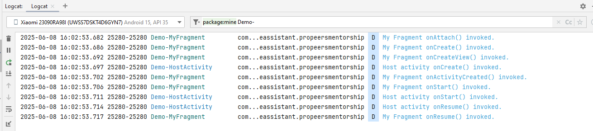
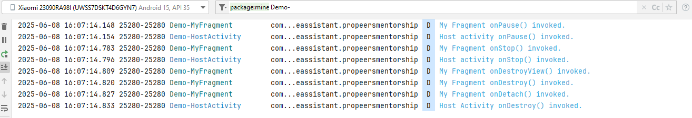

# Propeers mentorship assignments
    
## Description
This repo comprises of assignments that were carried out during the Propeers mentorship programme. 
    
## Assignments
*   Music player app with player shown in notification tray. 
*   Launch modes - Standard, SingleTop, SingleTask, SingleInstance.
*   Activity-Fragment Lifecycle demo

## Screenshots
### Music player app

### Music Player in Notification Tray

### Activity Fragment Lifecycle 
* Logs when HostActivity with Fragment is lauched 

* Logs when screen goes into background and screen is brought back to foreground.
  

* Logs when back button is pressed

